### Escuela Colombiana de Ingeniería
### Arquitecturas de Software - ARSW

## Escalamiento en Azure con Maquinas Virtuales, Sacale Sets y Service Plans

### Dependencias
* Cree una cuenta gratuita dentro de Azure. Para hacerlo puede guiarse de esta [documentación](https://azure.microsoft.com/es-es/free/students/). Al hacerlo usted contará con $100 USD para gastar durante 12 meses.

### Parte 0 - Entendiendo el escenario de calidad

Adjunto a este laboratorio usted podrá encontrar una aplicación totalmente desarrollada que tiene como objetivo calcular el enésimo valor de la secuencia de Fibonnaci.

**Escalabilidad**
Cuando un conjunto de usuarios consulta un enésimo número (superior a 1000000) de la secuencia de Fibonacci de forma concurrente y el sistema se encuentra bajo condiciones normales de operación, todas las peticiones deben ser respondidas y el consumo de CPU del sistema no puede superar el 70%.

### Parte 1 - Escalabilidad vertical

1. Diríjase a el [Portal de Azure](https://portal.azure.com/) y a continuación cree una maquina virtual con las características básicas descritas en la imágen 1 y que corresponden a las siguientes:
    * Resource Group = SCALABILITY_LAB
    * Virtual machine name = VERTICAL-SCALABILITY
    * Image = Ubuntu Server 
    * Size = Standard B1ls
    * Username = scalability_lab
    * SSH publi key = Su llave ssh publica


2. Para conectarse a la VM use el siguiente comando, donde las `x` las debe remplazar por la IP de su propia VM (Revise la sección "Connect" de la virtual machine creada para tener una guía más detallada).

    `ssh scalability_lab@xxx.xxx.xxx.xxx`
    
    

3. Instale node, para ello siga la sección *Installing Node.js and npm using NVM* que encontrará en este [enlace](https://linuxize.com/post/how-to-install-node-js-on-ubuntu-18.04/).

   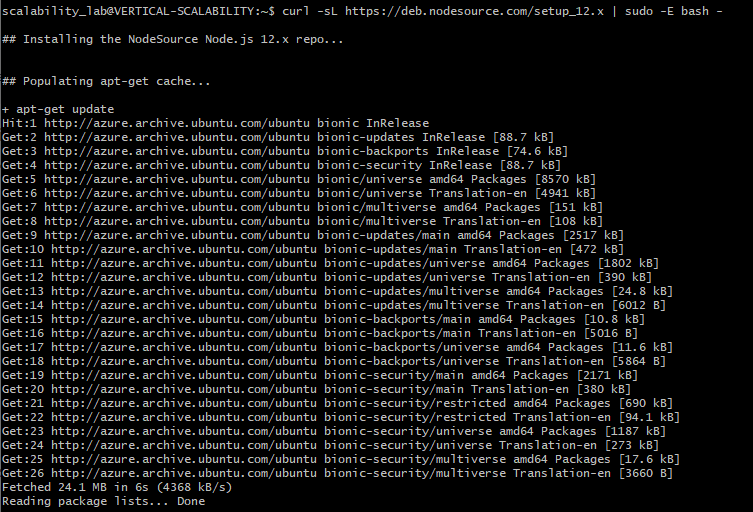
   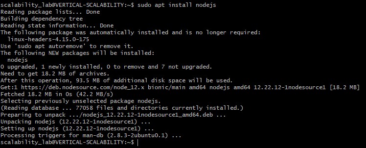

4. Para instalar la aplicación adjunta al Laboratorio, suba la carpeta `FibonacciApp` a un repositorio al cual tenga acceso y ejecute estos comandos dentro de la VM:

    `git clone <your_repo>`

    `cd <your_repo>/FibonacciApp`

    `npm install`
    
    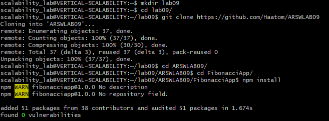

5. Para ejecutar la aplicación puede usar el comando `npm FibinacciApp.js`, sin embargo una vez pierda la conexión ssh la aplicación dejará de funcionar. Para evitar ese compartamiento usaremos *forever*. Ejecute los siguientes comando dentro de la VM.

    ` node FibonacciApp.js`
    
    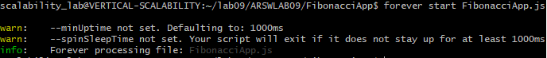

6. Antes de verificar si el endpoint funciona, en Azure vaya a la sección de *Networking* y cree una *Inbound port rule* tal como se muestra en la imágen. Para verificar que la aplicación funciona, use un browser y user el endpoint `http://xxx.xxx.xxx.xxx:3000/fibonacci/6`. La respuesta debe ser `The answer is 8`.


   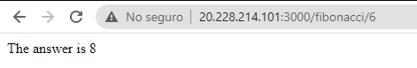

7. La función que calcula en enésimo número de la secuencia de Fibonacci está muy mal construido y consume bastante CPU para obtener la respuesta. Usando la consola del Browser documente los tiempos de respuesta para dicho endpoint usando los siguintes valores:
    * 1000000
    * 1010000
    * 1020000
    * 1030000
    * 1040000
    * 1050000
    * 1060000
    * 1070000
    * 1080000
    * 1090000

   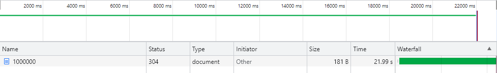
   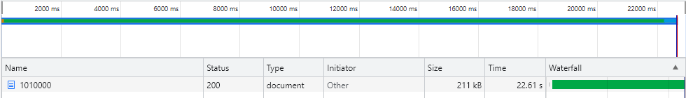
   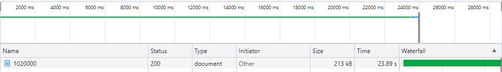
   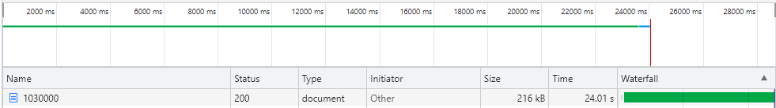
   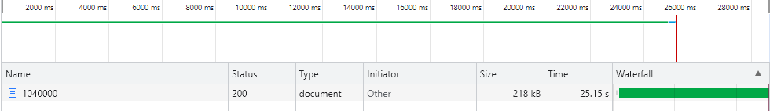
   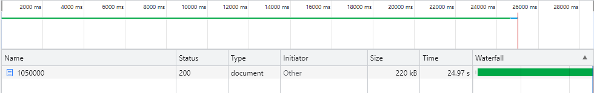
   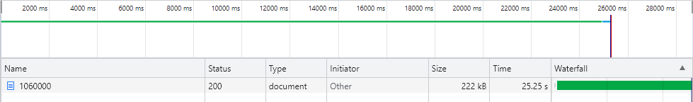
   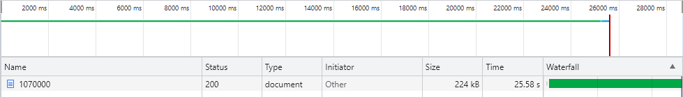
   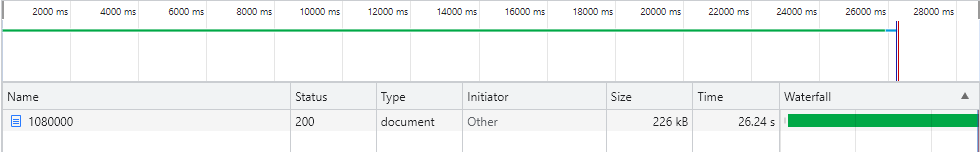
   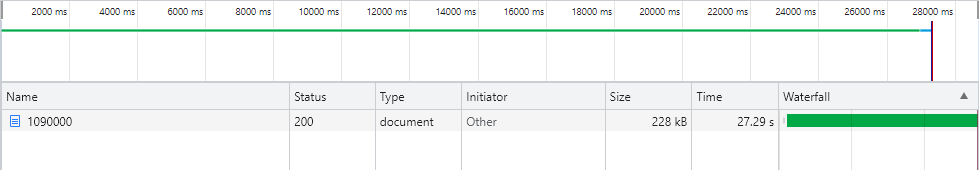

8. Dírijase ahora a Azure y verifique el consumo de CPU para la VM. (Los resultados pueden tardar 5 minutos en aparecer).


   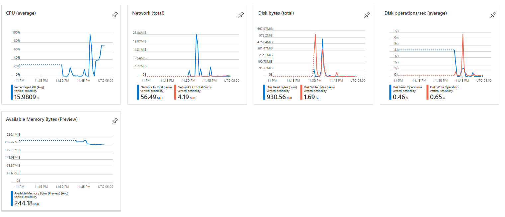

9. Ahora usaremos Postman para simular una carga concurrente a nuestro sistema. Siga estos pasos.
    * Instale newman con el comando `npm install newman -g`. Para conocer más de Newman consulte el siguiente [enlace](https://learning.getpostman.com/docs/postman/collection-runs/command-line-integration-with-newman/).
    * Diríjase hasta la ruta `FibonacciApp/postman` en una maquina diferente a la VM.
    * Para el archivo `[ARSW_LOAD-BALANCING_AZURE].postman_environment.json` cambie el valor del parámetro `VM1` para que coincida con la IP de su VM.
    * Ejecute el siguiente comando.

    ```
    newman run ARSW_LOAD-BALANCING_AZURE.postman_collection.json -e [ARSW_LOAD-BALANCING_AZURE].postman_environment.json -n 10 &
    newman run ARSW_LOAD-BALANCING_AZURE.postman_collection.json -e [ARSW_LOAD-BALANCING_AZURE].postman_environment.json -n 10
    ```
    
    
    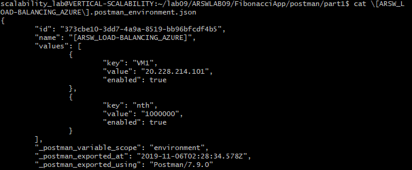
    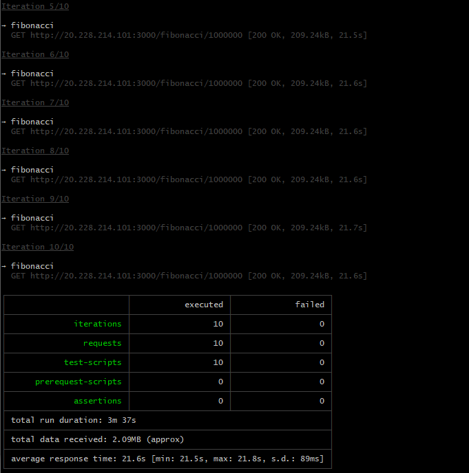

10. La cantidad de CPU consumida es bastante grande y un conjunto considerable de peticiones concurrentes pueden hacer fallar nuestro servicio. Para solucionarlo usaremos una estrategia de Escalamiento Vertical. En Azure diríjase a la sección *size* y a continuación seleccione el tamaño `B2ms`.


11. Una vez el cambio se vea reflejado, repita el paso 7, 8 y 9.

   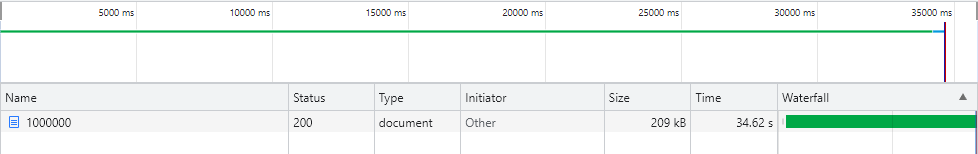
   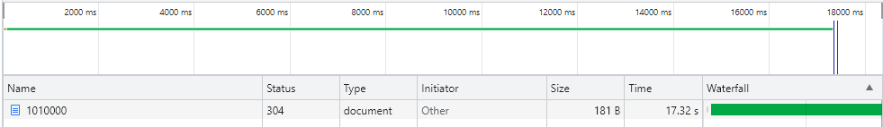
   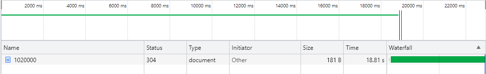
   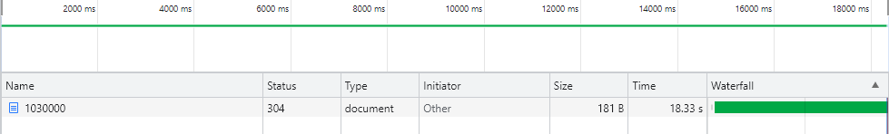
   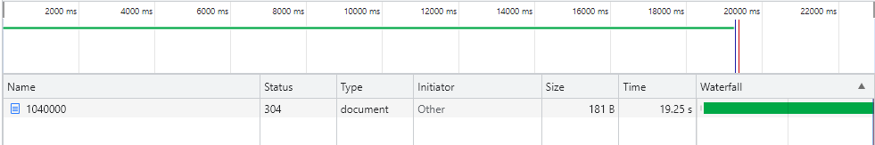
   
   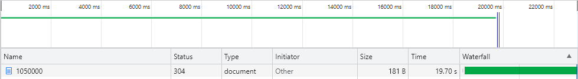
   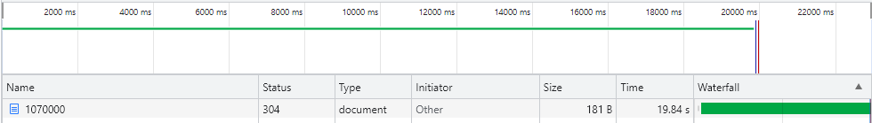
   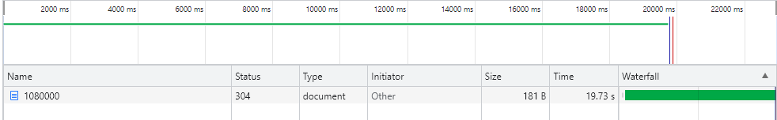
   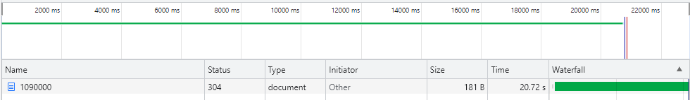
   
   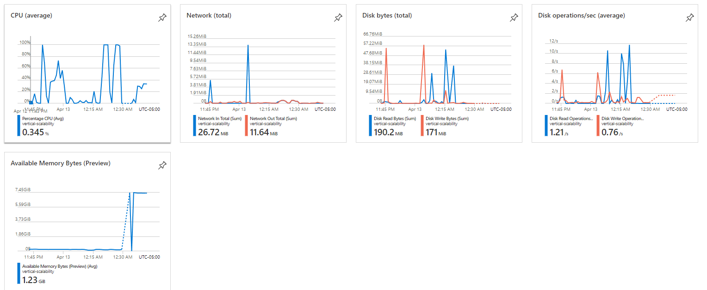
   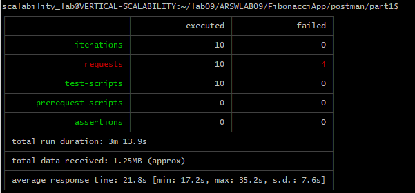
   


13. Evalue el escenario de calidad asociado al requerimiento no funcional de escalabilidad y concluya si usando este modelo de escalabilidad logramos cumplirlo.
   
   Si se cumple con el escenario de calidad propuesto ya que al realizar la escalabilidad vertical pues al aumentar las especificaciones de la VM, se aprovechan de una mejor forma y los tiempos de respuesta de las solicitudes es menor a momentos previos.
Evidenciendolo mucho más en la siguiente imagen, que muestra la disminución de consumo de CPU de la VM.
   

15. Vuelva a dejar la VM en el tamaño inicial para evitar cobros adicionales.

**Preguntas**

1. ¿Cuántos y cuáles recursos crea Azure junto con la VM?

Azure crea 5 recursos junto a la maquina virtual, los cuales son:

    * Virtual network/subnet
    * Public IP address
    * Network security group
    * Network interface
    * OS disk


3. ¿Brevemente describa para qué sirve cada recurso?

   * <b>Virtual network/subnet:</b><br> 
    
    Este tipo de red permite que diferentes recursos de Azure como lo son las máquinas virtuales, se puedan comunicarse de forma segura entre usuarios, con Internet y con las redes locales. VNet es similar a una red tradicional que funcionaría en su propio centro de datos, pero aporta las ventajas adicionales como lo son la escalabilidad, la disponibilidad y el aislamiento.
    
    * <b>Public IP address:</b><br>
    
    Dirección IP cuyo conjunto de números que identifica, de manera lógica y jerárquica, a una interfaz en la red de un dispositivo que utilice el protocolo o que corresponde al nivel de red del modelo TCP/IP, de tal manera que sea visible con internet y algunos servicios públicos de azure, un recurso cuya dirección ip sea publica, puede ser asociado a interfaces de red de máquinas virtuales, balanceadores de carga, firewalls, etc.

    
    * <b>Network security group:</b><br>
    
    Se utiliza "Azure network security group" para filtrar el trafico de red desde y para los recursos de Azure en una red virtual de Azure. Un grupo de seguridad se basa principalmente en un conjunto de reglas de seguridad que permiten o niegan el trafico de red entrante o el trafico de red saliente. Para cada regla, se debera especificar origen, destino, puerto y protocolo.

    * <b>Network interface:</b><br>

    Componente que permite que las VM de Azure se comunique con Internet y demas recursos locales, ya que es la capa IP la que selecciona una interfaz de red para el envío de paquetes.
    
    * <b>OS disk:</b><br>

    Almacenamiento del OS de la maquina virtual creada.

4. ¿Al cerrar la conexión ssh con la VM, por qué se cae la aplicación que ejecutamos con el comando `npm FibonacciApp.js`? ¿Por qué debemos crear un *Inbound port rule* antes de acceder al servicio?

   Cuando se inicia la conexion ssh con la VM, se inicia un proceso para este este servicio y este proceso quedara asociado al usuario el cual realizo la conexion, por lo que al cerrar la conexion este proceso se terminara.


5. Adjunte tabla de tiempos e interprete por qué la función tarda tando tiempo.

| N             | Standard_B1ls (s)    | Standars_B2ms (s) |
|---------------|----------------------|-------------------|
| 1000000       | 21.99 s              | 34.62 s           |
| 1010000       | 22.61 s              | 17.32 s           |
| 1020000       | 23.89 s              | 18.81 s           |
| 1030000       | 24.01 s              | 18.33 s           |
| 1040000       | 25.15 s              | 19.25 s           |
| 1050000       | 24.97 s              | 19.70 s           |
| 1060000       | 25.25 s              | 19.84 s           |
| 1070000       | 25.58 s              | 19.84 s           |
| 1080000       | 26.24 s              | 20.72 s           | 
| 1090000       | 27.29 s              | 21.99 s           |

6. Adjunte imágen del consumo de CPU de la VM e interprete por qué la función consume esa cantidad de CPU.


Cada petición realizada hace un gran uso de la CPU dado que se realizan cálculos con redundancia, esto porque no se esta haciendo uso de algun metodo o tecnica como la memorización la cual permita almacenar calculos que fueron realizados con anterioridad, además no se está implementando concurrencia lo que hace que se consuman más recursos y el tiempo de respuesta sea extenso.


8. Adjunte la imagen del resumen de la ejecución de Postman. Interprete:
    * Tiempos de ejecución de cada petición.
    * Si hubo fallos documentelos y explique.

   
   
   El tiempo promedio de respuesta de cada petición fue de 17.2s con un total de data recivida de: 1.25MB (approx)
   
   Los errores que se presentaron fueron: "read ECONNRESET"
   
   

9. ¿Cuál es la diferencia entre los tamaños `B2ms` y `B1ls` (no solo busque especificaciones de infraestructura)?

| Size             | vCPUs  | RAM (GiB)  |  Data disks| Max IOPS |Temp storage (GiB) | Cost/month |
|------------------|--------|------------|------------|----------|-------------------|------------|
|B1ls              |  1     |0.5         |2           |160       |4                  |3,80 US$    |
|B2ms              |  2     |8           |4           |1920      |16                 |60,74 US$   |


10. ¿Aumentar el tamaño de la VM es una buena solución en este escenario?, ¿Qué pasa con la FibonacciApp cuando cambiamos el tamaño de la VM?

Aunque aumentar el tamaño de la máquina virtual significa una disminución de uso recursos (como se pudo observar en el consumo de CPU), aun hace falta replantear FibonacciApp de tal manera que se memoricen valores anteriormente calculados, esto para lograr disminuir aun mas los tiempos de respuesta de la aplicación.

Sin embargo no hay que olvidar que es un sólo servidor el que está atendiendo todas las peticiones web y por lo tanto no garantizaria siempre una alta disponibilidad ante un desbordamiento de peticiones.

11. ¿Qué pasa con la infraestructura cuando cambia el tamaño de la VM? ¿Qué efectos negativos implica?

La maquina virtual se reinicia y a causa de todo esto se debe de realizar nuevamente una conexion segura usando el protocolo ssh, causando que en ese tiempo de reinicio la maquina no prestara su servicio web, causando que todas las peticiones que ocurran en este lapso de tiempo no sean atendidas. 

12. ¿Hubo mejora en el consumo de CPU o en los tiempos de respuesta? Si/No ¿Por qué?

Si, dado que la máquina virtual dispone de más recursos para realizar sus cálculos y atender a las peticiones.

19. Aumente la cantidad de ejecuciones paralelas del comando de postman a `4`. ¿El comportamiento del sistema es porcentualmente mejor?

Se realiza el cambio a 4 iteraciones, sin embargo la calidad/comportamiento no fue superior dando resultados cercanos al promedio obtenido en los resultados anteriores.

### Parte 2 - Escalabilidad horizontal

#### Crear el Balanceador de Carga

Antes de continuar puede eliminar el grupo de recursos anterior para evitar gastos adicionales y realizar la actividad en un grupo de recursos totalmente limpio.

1. El Balanceador de Carga es un recurso fundamental para habilitar la escalabilidad horizontal de nuestro sistema, por eso en este paso cree un balanceador de carga dentro de Azure tal cual como se muestra en la imágen adjunta.


2. A continuación cree un *Backend Pool*, guiese con la siguiente imágen.


3. A continuación cree un *Health Probe*, guiese con la siguiente imágen.


4. A continuación cree un *Load Balancing Rule*, guiese con la siguiente imágen.


5. Cree una *Virtual Network* dentro del grupo de recursos, guiese con la siguiente imágen.


#### Crear las maquinas virtuales (Nodos)

Ahora vamos a crear 3 VMs (VM1, VM2 y VM3) con direcciones IP públicas standar en 3 diferentes zonas de disponibilidad. Después las agregaremos al balanceador de carga.

1. En la configuración básica de la VM guíese por la siguiente imágen. Es importante que se fije en la "Avaiability Zone", donde la VM1 será 1, la VM2 será 2 y la VM3 será 3.


2. En la configuración de networking, verifique que se ha seleccionado la *Virtual Network*  y la *Subnet* creadas anteriormente. Adicionalmente asigne una IP pública y no olvide habilitar la redundancia de zona.


3. Para el Network Security Group seleccione "avanzado" y realice la siguiente configuración. No olvide crear un *Inbound Rule*, en el cual habilite el tráfico por el puerto 3000. Cuando cree la VM2 y la VM3, no necesita volver a crear el *Network Security Group*, sino que puede seleccionar el anteriormente creado.


4. Ahora asignaremos esta VM a nuestro balanceador de carga, para ello siga la configuración de la siguiente imágen.

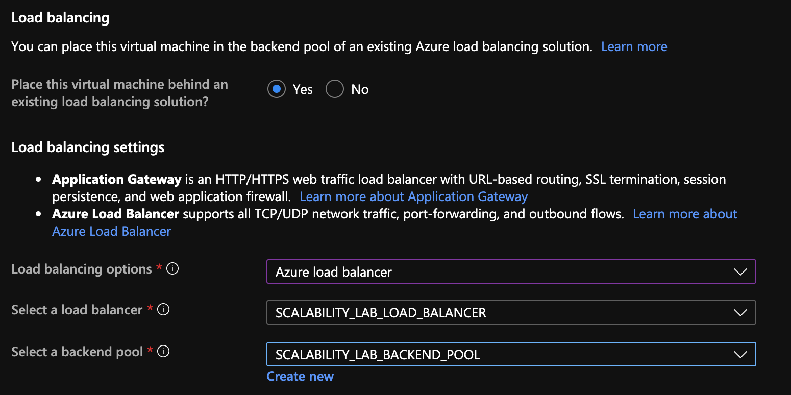

5. Finalmente debemos instalar la aplicación de Fibonacci en la VM. para ello puede ejecutar el conjunto de los siguientes comandos, cambiando el nombre de la VM por el correcto

```
git clone https://github.com/daprieto1/ARSW_LOAD-BALANCING_AZURE.git

curl -o- https://raw.githubusercontent.com/creationix/nvm/v0.34.0/install.sh | bash
source /home/vm1/.bashrc
nvm install node

cd ARSW_LOAD-BALANCING_AZURE/FibonacciApp
npm install

npm install forever -g
forever start FibonacciApp.js
```

Realice este proceso para las 3 VMs, por ahora lo haremos a mano una por una, sin embargo es importante que usted sepa que existen herramientas para aumatizar este proceso, entre ellas encontramos Azure Resource Manager, OsDisk Images, Terraform con Vagrant y Paker, Puppet, Ansible entre otras.

#### Probar el resultado final de nuestra infraestructura

1. Porsupuesto el endpoint de acceso a nuestro sistema será la IP pública del balanceador de carga, primero verifiquemos que los servicios básicos están funcionando, consuma los siguientes recursos:

```
http://52.155.223.248/
http://52.155.223.248/fibonacci/1
```

2. Realice las pruebas de carga con `newman` que se realizaron en la parte 1 y haga un informe comparativo donde contraste: tiempos de respuesta, cantidad de peticiones respondidas con éxito, costos de las 2 infraestrucruras, es decir, la que desarrollamos con balanceo de carga horizontal y la que se hizo con una maquina virtual escalada.

3. Agregue una 4 maquina virtual y realice las pruebas de newman, pero esta vez no lance 2 peticiones en paralelo, sino que incrementelo a 4. Haga un informe donde presente el comportamiento de la CPU de las 4 VM y explique porque la tasa de éxito de las peticiones aumento con este estilo de escalabilidad.

```
newman run ARSW_LOAD-BALANCING_AZURE.postman_collection.json -e [ARSW_LOAD-BALANCING_AZURE].postman_environment.json -n 10 &
newman run ARSW_LOAD-BALANCING_AZURE.postman_collection.json -e [ARSW_LOAD-BALANCING_AZURE].postman_environment.json -n 10 &
newman run ARSW_LOAD-BALANCING_AZURE.postman_collection.json -e [ARSW_LOAD-BALANCING_AZURE].postman_environment.json -n 10 &
newman run ARSW_LOAD-BALANCING_AZURE.postman_collection.json -e [ARSW_LOAD-BALANCING_AZURE].postman_environment.json -n 10
```

**Preguntas**

* ¿Cuáles son los tipos de balanceadores de carga en Azure y en qué se diferencian?, ¿Qué es SKU, qué tipos hay y en qué se diferencian?, ¿Por qué el balanceador de carga necesita una IP pública?

Los dos tipos de balanceadores de carga que utiliza Azure son:
   * **Publico:** Proporciona conexiones salientes para máquinas virtuales dentro de su misma red virtual, mediante la traducción de ip privadas a ip publicas.
   * **Privadas:** Se utilizan para equilibrar el trafico dentro de la red virtual.

   **¿Qué es SKU, qué tipos hay y en qué se diferencian?**
   
   Azure Container Registry está disponible en varios niveles de servicio (también conocidos como SKU). SKU Significa Unidad de mantenimiento de existencias (Stock Keeping Unit), son un código único asignado a un servicio o producto dentro de azure y representan la posibilidad para comprar existencias.
   
   * **Básico:** Un punto de entrada con costos optimizados para que los desarrolladores aprendan sobre Azure Container Registry. Los registros básicos tienen las mismas capacidades programáticas que Standard y Premium.

   * **Estándar:** Los registros estándar ofrecen las mismas capacidades que los básicos, con un mayor rendimiento de imágenes y almacenamiento incluido. Los registros estándar deben satisfacer las necesidades de la mayoría de los escenarios de producción.

   * **Premium:** Los registros Premium proporcionan la mayor cantidad de almacenamiento incluido y operaciones simultáneas, lo que permite escenarios de gran volumen. Además de un mayor rendimiento de imágenes, Premium agrega características como la replicación geográfica para administrar un solo registro en múltiples regiones, confianza en el contenido para la firma de etiquetas de imagen, enlace privado con puntos finales privados para restringir el acceso al registro.

* ¿Cuál es el propósito del *Backend Pool*?

Define como evaluar los diferentes Back-Ends a través de sondas de estado, además de producir equilibrio de carga entre estos, en otras palabras, define el grupo de recursos que brindarán tráfico para una regla de equilibrio de carga determinada.


* ¿Cuál es el propósito del *Health Probe*?

Se deben realizar sondeos de estado para detectar el el endless point del Back-End, se determinan que instancias recibiran nuevos flujos, en otras palabras, determina si la instancia está en buen estado. Si la instancia falla su prueba de estado suficientes veces, dejará de recibir tráfico hasta que comience a pasar las pruebas de estado nuevamente.

* ¿Cuál es el propósito de la *Load Balancing Rule*? 
   
El modo de distribución predeterminado para Azure Load Balancer es un hash de tupla de cinco elementos. La tupla contiene:
   
   * IP de origen.
   * Puerto de origen.
   * IP de destino.
   * Puerto de destino.
   * Tipo de protocolo.
 
* ¿Qué tipos de sesión persistente existen, por qué esto es importante y cómo puede afectar la escalabilidad del sistema?.

El hash se utiliza para asignar el tráfico a los servidores disponibles. El algoritmo solo proporciona adherencia dentro de una sesión de transporte. Los paquetes que se encuentran en la misma sesión se dirigen a la misma dirección IP del centro de datos tras el punto de conexión con equilibrio de carga. Cuando el cliente inicia una nueva sesión desde la misma IP de origen, el puerto de origen cambia y provoca que el tráfico vaya hacia otro punto de conexión del centro de datos.


* ¿Qué es una *Virtual Network*? ¿Qué es una *Subnet*? ¿Para qué sirven los *address space* y *address range*?

 Una *Virtual Network* o red virtual es una representación de la red propia en la nube, es un aislamiento lógico de la nube de Azure dedicada a su suscripción.
 
* ¿Qué son las *Availability Zone* y por qué seleccionamos 3 diferentes zonas?. ¿Qué significa que una IP sea *zone-redundant*?

* Es una oferta de alta disponibilidad que protege las aplicaciones y los datos de fallas que puedan ocurrir en el datacenter, las zonas de disponibilidad son ubicaciones físicas de una región determinada por Azure, cada zona cuenta con uno o varios centros de datos.
   * Se dividen en 3 diferentes zonas para para proteger las aplicaciones y los datos de fallas del centro de datos, se ofrece un mejor SLA de tiempo de activiad de VM de 99.99%


* ¿Cuál es el propósito del *Network Security Group*?

Se puede filtrar el trafico de red hacia los recursos de Azure y desde los recursos de Azure en una red virtual de Azure con un grupo de seguridd de red, además contienen reglas de seguridad que permiten o niegan el táfico de una red entrante.

* Informe de newman 1 (Punto 2)


Luego de realizar los pasos correspondientes para realizar las respectivas pruebas en Escalabilidad Vertical y Horizontal, se presenta primero la Escalabilidad Horizontal, en la que se evidencia que cada solicitud se demoró en promedio 27 segundos, donde ninguna solicitud falló.

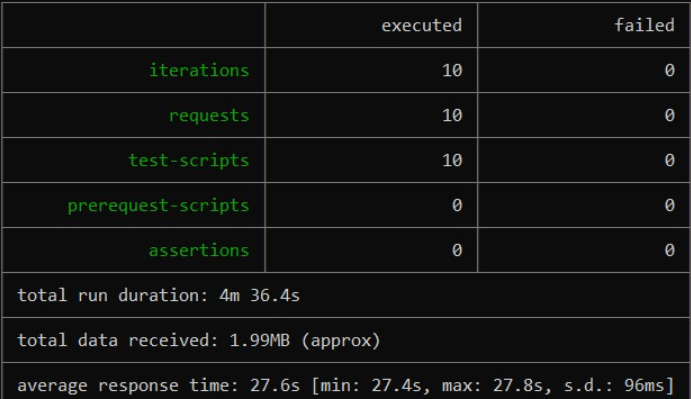

Ahora, se presentan las pruebas luego de realizar Escalabilidad Vertical. Como se ve a continuación, cada solicitud se demoró en promedio 27 segundos también, donde 4 solicitudes fallaron.

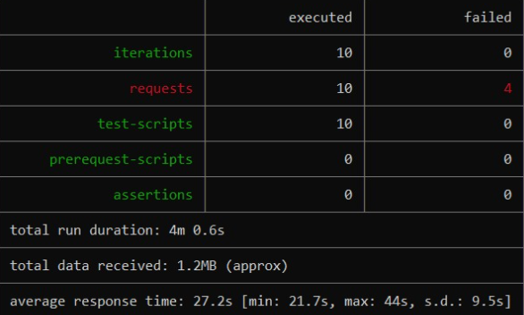


Uso y comportamiento de la CPU de las 4 maquinas virtuales:

Maquina 1: (60% de uso)

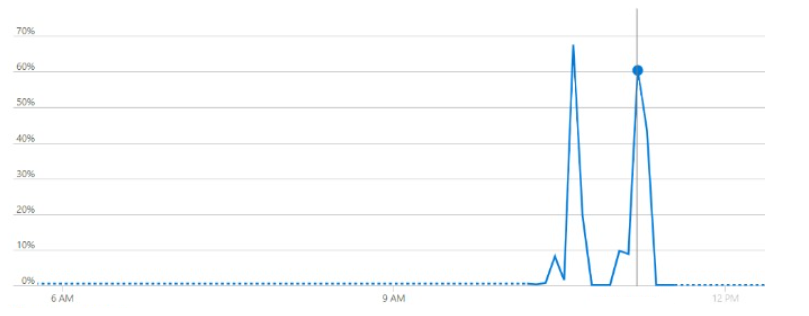

Maquina 2: (47% de uso)

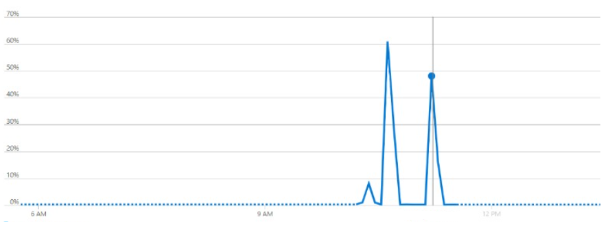

Maquina 3: (32% de uso)

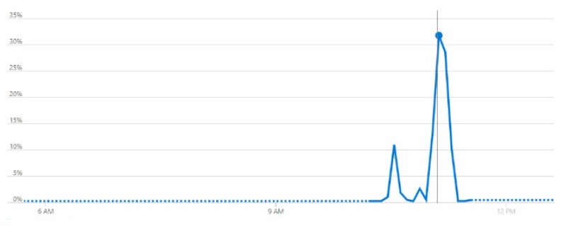

Maquina 4: (10% de uso)

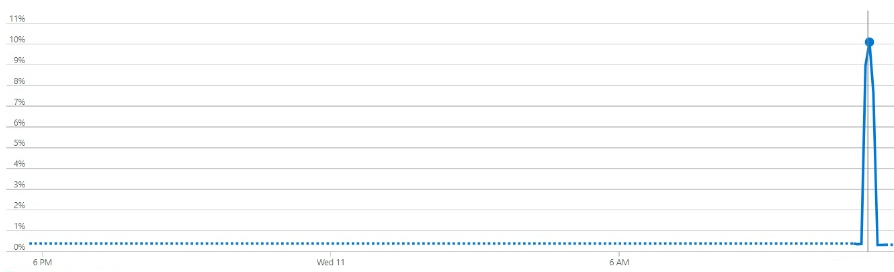


* Presente el Diagrama de Despliegue de la solución.


